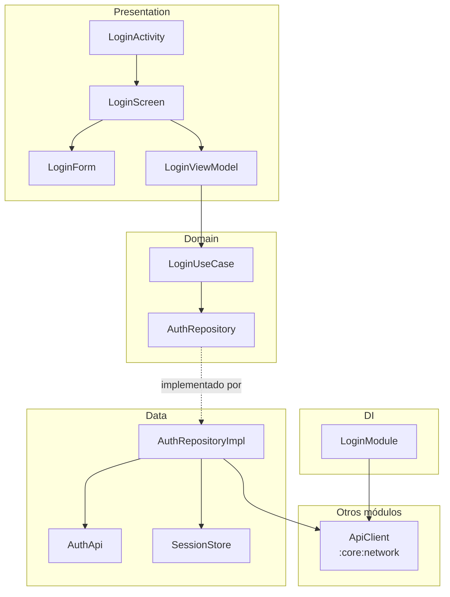

# android-module-map

Automatically generate architecture diagrams and analysis documents for Kotlin/Android Gradle
modules. Two Python scripts turn your source code into layered architecture diagrams, dependency
graphs, flow charts, and a structured audit — without running Gradle, without a model, and with
deterministic output every time.

**The problem:** understanding how an Android module is wired — which layers talk to which, where
the Hilt bindings land, what calls what — usually means reading every file or drawing diagrams by
hand. This tool reads the code and draws them for you.

```
module_map.py        source code  →  <module>.module-map.json
module_diagrams.py   map JSON     →  <module>.md  (Mermaid diagrams + analysis)
```



<sup>Generated from the synthetic project in <a href="examples/">examples/</a>.</sup>

## Features

- **Layered architecture diagrams** — automatically groups classes into Presentation, Domain,
  Data, and DI layers by package names, annotations, and roles
- **Flow and sequence diagrams** — traces ViewModel → use case → repository → API call chains
  with AST-verified receiver types
- **Hilt/Dagger injection graph** — maps `@Provides`, `@Binds`, `@Inject` constructors, and
  field injection across the module
- **Layer violation detection** — flags forbidden dependencies (e.g., Domain → Data) with
  `file:line` evidence
- **Cross-module dependency tracking** — shows which modules use this one and which it depends
  on, matching Gradle declarations against actual code usage
- **Deterministic output** — same code always produces the same map and diagrams, so it works
  in CI, code review, or as a Claude Code skill
- **Zero-config start** — auto-installs its own tree-sitter environment on first run; no
  manual dependency setup needed

## Quick Start

> **Requires Python 3.10+.** Works on Linux, macOS, and Windows.

Clone the repo (or add it as a skill — see [Claude Code skill](#claude-code-skill) below), then
run both scripts from the root of your Android project:

```bash
# Step 1: Generate the JSON map
python3 path/to/scripts/module_map.py feature/login

# Step 2: Generate diagrams and analysis
python3 path/to/scripts/module_diagrams.py feature/login
```

On first run, `module_map.py` creates a virtual environment in `~/.cache/module-map/venv` and
installs `tree-sitter` there (requires network). Subsequent runs start instantly.

**Expected output:**

```
[module_map +  0.0s] :feature:login: parseando 6 archivos...
[module_map +  0.1s] feature/login/docs/architecture/feature-login.module-map.json: 19 nodos, 5 externos, 29 aristas, 0 avisos
```

```
generado: feature/login/docs/architecture/feature-login.md
```

**What gets written:**

```
feature/login/docs/architecture/
├── feature-login.module-map.json   ← structured map (nodes + edges)
├── feature-login.md                ← full document with all diagrams
└── feature-login.classes.md        ← only when --only is used
```

### Map multiple modules at once

```bash
# Every module inside a directory (or . for the whole project)
python3 path/to/scripts/module_map.py features
python3 path/to/scripts/module_diagrams.py features
```

With several modules, `module_diagrams.py` also writes an `index.md` with the Gradle dependency
graph between them.

### Generate a single section

```bash
python3 path/to/scripts/module_diagrams.py features --module login --only classes
```

## What You Get

Each module document can contain these sections (all generated by default; `--only` selects a
subset):

| Key | Section |
|---|---|
| `layers` | Layered architecture diagram (Presentation, Domain, Data, DI) |
| `flows` | Flows from the ViewModels: ViewModel → function → use case → repository → API |
| `sequence` | Sequence diagram of one flow |
| `modules` | Module dependencies: declared in Gradle, and modules that use this one |
| `hilt` | Hilt dependency injection: providers, bindings and consumers |
| `classes` | Table of every class, interface and object with kind, layer, role and KDoc |
| `violations` | Layer violations, with `file:line` evidence |
| `entries` | Entry points: Manifest components and usages from other modules |
| `external` | External dependencies, by module and by library |
| `review` | Edges to review: corrections, low-confidence edges, warnings, discarded count |

A subset is written to its own file (`<module>.<sections>.md`), so it never overwrites the full
document.

## Requirements

- **Python 3.10+.** Nothing to install by hand: `module_map.py` auto-bootstraps its
  dependencies (`tree-sitter==0.26.0`, `tree-sitter-kotlin==1.1.0`). `module_diagrams.py` uses
  only the standard library.
- **[codegraph](https://www.npmjs.com/package/@colbymchenry/codegraph)** (optional, tested with
  1.6.1). Provides calls, instantiations and references. Run `codegraph init` once at the root
  of the Android project. Without it the map still has the structure, but the flow and sequence
  diagrams will be empty.
- **Android CLI** (optional, off by default). `--android-cli` runs `android describe` and
  attaches build metadata. It runs Gradle, which can take minutes.

## Options

**`module_map.py <dir>`** — `<dir>` is a module, a package inside a module, or a directory
containing several modules.

| Option | Meaning |
|---|---|
| `-o, --output` | Directory to collect the maps in, instead of inside each module. With a single module it can also be a `.json` file |
| `--no-codegraph` | Do not read the codegraph index |
| `--android-cli` | Run `android describe` and attach its build metadata |

**`module_diagrams.py <path>`** — `<path>` is a module, a directory of modules, a directory of
maps, or one map JSON.

| Option | Meaning |
|---|---|
| `--only layers,flows` | Generate only these sections, in `<module>.<sections>.md` |
| `--module engine` | With several modules, process only that one |
| `--flow Class.function` | Flow for the sequence diagram (one module). Defaults to the ViewModel function with the longest call chain |
| `--sections` | List the available section keys and exit |
| `-o, --output` | Output directory instead of next to each map. With one module it can also be a `.md` file |

To collect everything in one directory, pass `-o <directory>` to `module_map.py` and give that
directory to `module_diagrams.py`.

## How It Works

`module_map.py` combines three sources:

1. **AST** (tree-sitter-kotlin): declarations, signatures, KDoc, annotations, inheritance,
   constructor dependencies, Hilt bindings and types used in signatures. Each class gets a role
   (`viewmodel`, `composable`, `repository`, `usecase`, `dao`, `api_service`, ...) inferred from
   annotations, supertypes, name suffixes, and import-based layer hints.
2. **codegraph**: calls, instantiations and references, including cross-module ones. The script
   reads `.codegraph/codegraph.db` directly and lifts each method to the class that contains it.
3. **Gradle and AndroidManifest**: module type, declared dependencies and components, read from
   the files without running Gradle.

### Edge validation

codegraph resolves symbols by name, so a call to `isAuthorized()` can be linked to an unrelated
namesake. The file that makes the call settles the target, in this order:

1. the declared type of the receiver (`repo.load()`, or `useCase()` through `operator invoke`);
2. the import of the referenced name, which overrides codegraph's target when they differ;
3. an import of the target class itself;
4. the target being in the same package or covered by a star import.

An edge with none of these is discarded. The result favors a missing arrow over a false one.

### The JSON map

One node or edge per line, so `grep` works on it.

| Key | Content |
|---|---|
| `module` | Gradle path, type, namespace, plugins, declared dependencies, Manifest |
| `nodes` | Declarations: id (FQN), kind, role, file, lines, KDoc, constructor, properties, functions |
| `external_nodes` | Symbols outside the module (`origin: project` or `library`) |
| `edges` | `extends`, `implements`, `depends_on`, `provides`, `uses_type`, `calls`, `instantiates`, `references`, each with `provenance`, `weight` and `details` |
| `sources`, `warnings` | Which sources were used, and files that parsed only partially |
| `legend` | Meaning of each edge kind and provenance |

### Layers and violations

`module_diagrams.py` assigns a layer by package segment (`ui`, `presentation`, `domain`, `data`,
`di`) and, failing that, by role or import-based heuristics. The rules are constants at the top
of the script (`LAYER_BY_SEGMENT`, `LAYER_BY_ROLE`, `FORBIDDEN`); edit them if your packages use
other names.

## Testing

Run the test suite (111 tests covering AST parsing, diagram generation, end-to-end pipeline,
and edge cases):

```bash
python tests/test_module_map.py
```

Expected output:

```
=== module_map.py (AST-only, synthetic fixtures) ===
  PASS  output file created
  PASS  schema is module-map/1
  ...

=== End-to-end: module_map.py -> module_diagrams.py ===
  PASS  map JSON created
  PASS  diagram doc created
  ...

==================================================
  111 passed, 0 failed
==================================================
```

## Claude Code Skill

This repository is laid out as a skill: `SKILL.md` at the root with the scripts next to it.
To use it, clone it into the skills directory of your project:

```bash
git clone https://github.com/pfranccino/android-module-map.git .claude/skills/module-map
```

The skill runs both scripts and then does the two things a script cannot: it checks the edges
listed under "review" against the source, and describes the classes that have no KDoc.

## Limitations

- **Syntactic only.** Types that Kotlin infers are unknown, so a property without a declared
  type has no type in the map.
- **Kotlin only.** Java classes appear through codegraph with minimal information.
- **No test source sets.** Test code is excluded by design.
- **Calls require codegraph.** Without it, flow and sequence diagrams are empty.
- **Gradle via regex.** Dependencies added by convention plugins or type-safe project accessors
  with camelCase names may not be detected.
- **Not extracted:** navigation routes, UI state transitions, and `Flow` collectors.
- **Spanish output.** CLI messages, the JSON legend, and generated documents are in Spanish.

## Contributing

Contributions are welcome. Please open an issue before submitting large changes.

```bash
git clone https://github.com/pfranccino/android-module-map.git
cd android-module-map
python tests/test_module_map.py   # runs the full test suite
```

## License

MIT
