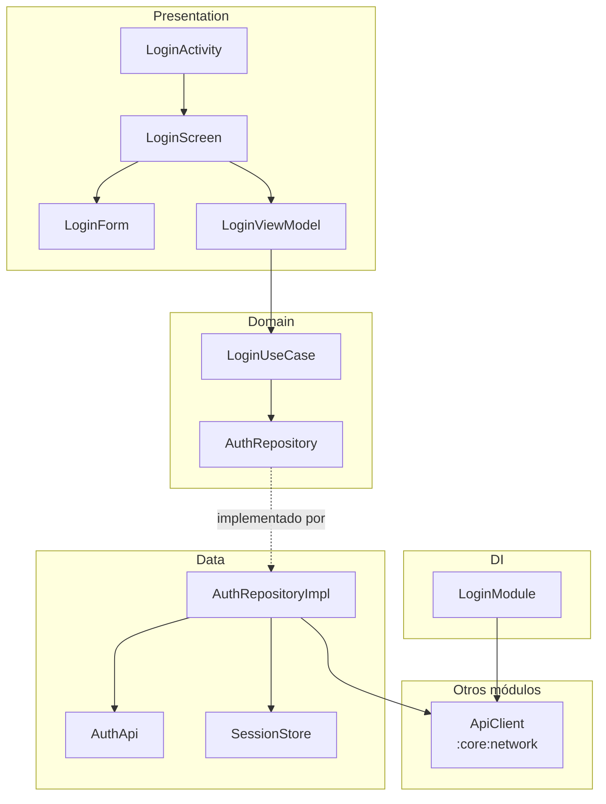
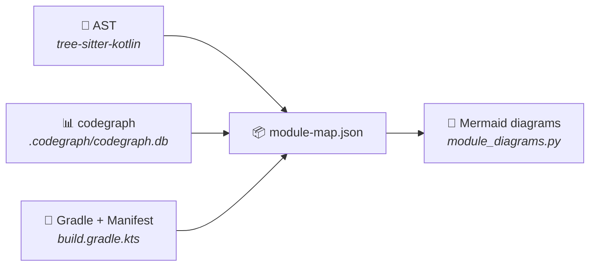

<div align="center">

# 🏗️ android-module-map

**Turn your Kotlin/Android modules into architecture diagrams — automatically.**

[](https://python.org)
[](#testing)
[](LICENSE)

Two scripts. No Gradle build. No AI model. Same input → same output, every time.

[Quick Start](#-quick-start) · [Features](#-features) · [How It Works](#-how-it-works) · [Examples](examples/)

</div>

---

Understanding how an Android module is wired — which layers talk to which, where
Hilt bindings land, what calls what — usually means reading every file or drawing
diagrams by hand. **This tool reads the code and draws them for you.**

```
module_map.py        source code  →  .module-map.json
module_diagrams.py   map JSON     →  .md  (Mermaid diagrams + analysis)
```

<details>
<summary><b>📊 See a generated diagram</b> (click to expand)</summary>

<br>

> Generated from the synthetic project in [`examples/`](examples/)



</details>

---

## ✨ Features

| | Feature | Description |
|---|---|---|
| 🧱 | **Layered architecture** | Groups classes into Presentation, Domain, Data, and DI by package, annotation, and role |
| 🔀 | **Flow diagrams** | Traces ViewModel → use case → repository → API with AST-verified receivers |
| 📐 | **Sequence diagrams** | Step-by-step call sequence for any ViewModel function |
| 💉 | **Hilt/Dagger graph** | Maps `@Provides`, `@Binds`, `@Inject` across the module |
| 🚨 | **Violation detection** | Flags forbidden layer dependencies with `file:line` evidence |
| 🔗 | **Cross-module tracking** | Matches Gradle declarations against actual code usage |
| ♻️ | **Deterministic** | Same code → same output. Works in CI, code review, or as a Claude Code skill |
| ⚡ | **Zero config** | Auto-installs tree-sitter on first run — nothing to set up |

---

## 🚀 Quick Start

> **Requires Python 3.10+** · Works on Linux, macOS, and Windows

```bash
# 1️⃣ Generate the JSON map
python3 path/to/scripts/module_map.py feature/login

# 2️⃣ Generate diagrams and analysis
python3 path/to/scripts/module_diagrams.py feature/login
```

On first run, `module_map.py` creates a venv in `~/.cache/module-map/venv` and installs
`tree-sitter` (requires network once). After that, it starts instantly.

<details>
<summary><b>See expected output</b></summary>

```
[module_map +  0.0s] :feature:login: parseando 6 archivos...
[module_map +  0.1s] feature/login/docs/architecture/feature-login.module-map.json: 19 nodos, 5 externos, 29 aristas, 0 avisos
```

```
generado: feature/login/docs/architecture/feature-login.md
```

```
feature/login/docs/architecture/
├── feature-login.module-map.json   ← structured map (nodes + edges)
├── feature-login.md                ← full document with all diagrams
└── feature-login.classes.md        ← only when --only is used
```

</details>

### Multiple modules

```bash
python3 path/to/scripts/module_map.py features
python3 path/to/scripts/module_diagrams.py features
```

Generates an `index.md` with the Gradle dependency graph across all modules.

### Single section

```bash
python3 path/to/scripts/module_diagrams.py features --module login --only classes
```

---

## 📄 What You Get

Each document can include these sections — all generated by default, `--only` picks a subset:

| Key | Section | What it shows |
|:---:|---|---|
| `layers` | Architecture diagram | Classes grouped by layer with dependency arrows |
| `flows` | Flow diagram | ViewModel → use case → repository → API chains |
| `sequence` | Sequence diagram | Step-by-step call trace for one flow |
| `modules` | Module graph | Gradle dependencies + cross-module usage |
| `hilt` | DI diagram | Providers, bindings, and injection consumers |
| `classes` | Class table | Every type with kind, layer, role, and KDoc |
| `violations` | Layer violations | Forbidden dependencies with file:line evidence |
| `entries` | Entry points | Manifest components + usages from other modules |
| `external` | External deps | Dependencies by module and by library |
| `review` | Review edges | Corrections, low-confidence links, warnings |

> Subsets are written to `<module>.<sections>.md` — the full document is never overwritten.

---

## 📋 Requirements

| Dependency | Required | Notes |
|---|:---:|---|
| **Python 3.10+** | ✅ | `module_map.py` auto-bootstraps `tree-sitter` in a dedicated venv |
| **[codegraph](https://www.npmjs.com/package/@colbymchenry/codegraph)** | ❌ | Adds calls, instantiations, references. Run `codegraph init` once. Without it: no flow/sequence diagrams |
| **Android CLI** | ❌ | `--android-cli` attaches Gradle build metadata. Slow (runs Gradle) |

---

## ⚙️ Options

<details>
<summary><b>module_map.py</b> <code>&lt;dir&gt;</code></summary>

`<dir>` is a module, a package inside a module, or a directory containing several modules.

| Option | Meaning |
|---|---|
| `-o, --output` | Collect maps in this directory (or a `.json` file for one module) |
| `--no-codegraph` | Skip the codegraph index |
| `--android-cli` | Run `android describe` and attach build metadata |

</details>

<details>
<summary><b>module_diagrams.py</b> <code>&lt;path&gt;</code></summary>

`<path>` is a module, a directory of modules, a directory of maps, or one map JSON.

| Option | Meaning |
|---|---|
| `--only layers,flows` | Generate only these sections |
| `--module engine` | Process only this module from a multi-module directory |
| `--flow Class.function` | Pick the flow for the sequence diagram |
| `--sections` | List available section keys and exit |
| `-o, --output` | Output directory (or `.md` file for one module) |

</details>

---

## 🔍 How It Works

`module_map.py` combines three sources into a single JSON map:



| Source | What it provides |
|---|---|
| **AST** | Declarations, signatures, KDoc, annotations, inheritance, Hilt bindings, roles |
| **codegraph** | Calls, instantiations, references (including cross-module) |
| **Gradle + Manifest** | Module type, dependencies, components — no Gradle execution needed |

<details>
<summary><b>Edge validation</b> — how false positives are filtered</summary>

<br>

codegraph resolves by name, so `isAuthorized()` can match an unrelated namesake. Each edge is
validated against the calling file:

1. **Receiver type** — `repo.load()` resolves via the declared type of `repo`
2. **Import match** — the import overrides codegraph's target when they differ
3. **Target import** — an import of the target class itself
4. **Same package** — target is in the caller's package or covered by a star import

No match → edge discarded. **Missing arrow > false arrow.**

</details>

<details>
<summary><b>JSON map structure</b></summary>

<br>

One node or edge per line, so `grep` works on it.

| Key | Content |
|---|---|
| `module` | Gradle path, type, namespace, plugins, dependencies, Manifest |
| `nodes` | Declarations: FQN, kind, role, file, lines, KDoc, constructor, functions |
| `external_nodes` | Symbols outside the module (`project` or `library`) |
| `edges` | Typed relationships with `provenance`, `weight`, and `details` |
| `legend` | Meaning of each edge kind and provenance |

</details>

<details>
<summary><b>Layer assignment</b></summary>

<br>

Layers are assigned by package segment (`ui` → Presentation, `domain` → Domain, `data` → Data,
`di` → DI), then by role, then by import heuristics. Customize by editing `LAYER_BY_SEGMENT`,
`LAYER_BY_ROLE`, and `FORBIDDEN` at the top of `module_diagrams.py`.

</details>

---

## 🧪 Testing

```bash
python tests/test_module_map.py
```

<details>
<summary><b>111 tests</b> covering AST parsing, diagram generation, E2E pipeline, and edge cases</summary>

```
=== module_map.py (AST-only, synthetic fixtures) ===
  PASS  output file created
  PASS  schema is module-map/1
  PASS  module path is :feature:login
  PASS  node LoginViewModel exists
  PASS  AuthRepositoryImpl implements AuthRepository
  ...

=== module_diagrams.py (single module, example map) ===
  PASS  has mermaid block
  PASS  has flows section
  PASS  no violations detected
  ...

=== End-to-end: module_map.py -> module_diagrams.py ===
  PASS  map JSON created
  PASS  diagram doc created
  PASS  e2e: multiple mermaid diagrams
  ...

==================================================
  111 passed, 0 failed
==================================================
```

</details>

---

## 🤖 Claude Code Skill

Use this as a [Claude Code skill](https://docs.anthropic.com/en/docs/claude-code) by cloning
into your project's skills directory:

```bash
git clone https://github.com/pfranccino/android-module-map.git .claude/skills/module-map
```

The skill runs both scripts, then goes further: it verifies edges listed under "review" against
the source and describes classes missing KDoc.

---

## ⚠️ Limitations

> These are known boundaries — not bugs.

- **Syntactic only** — Kotlin-inferred types are invisible to the AST
- **Kotlin only** — Java classes appear via codegraph with minimal info
- **No test sources** — test code is excluded by design
- **Calls need codegraph** — without it, flow and sequence diagrams are empty
- **Gradle via regex** — convention plugins and camelCase accessors may be missed
- **Not extracted** — navigation routes, UI state transitions, `Flow` collectors
- **Spanish output** — CLI messages, JSON legend, and generated docs are in Spanish

---

## 🤝 Contributing

Contributions welcome! Please open an issue before submitting large changes.

```bash
git clone https://github.com/pfranccino/android-module-map.git
cd android-module-map
python tests/test_module_map.py   # run the full test suite
```

---

<div align="center">

**[MIT License](LICENSE)**

Made for Android developers who'd rather read diagrams than grep through modules.

</div>
