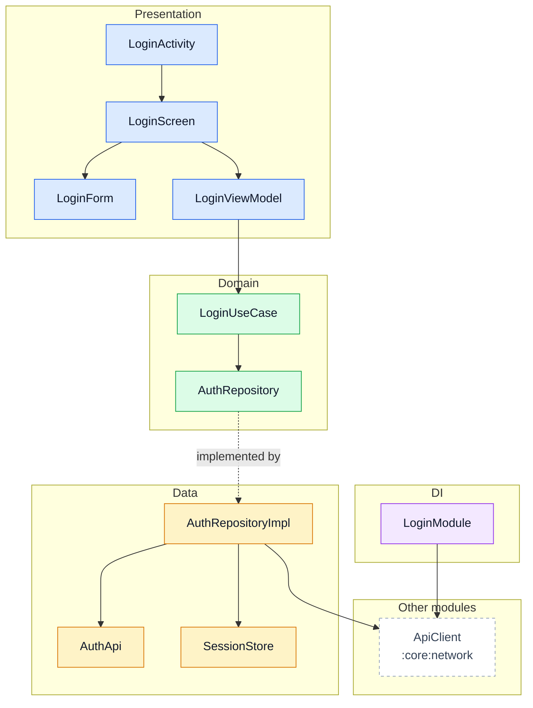
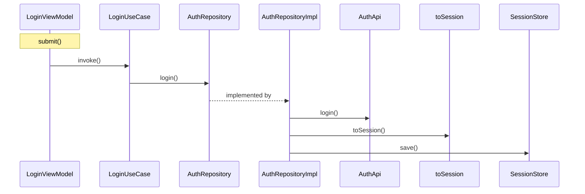
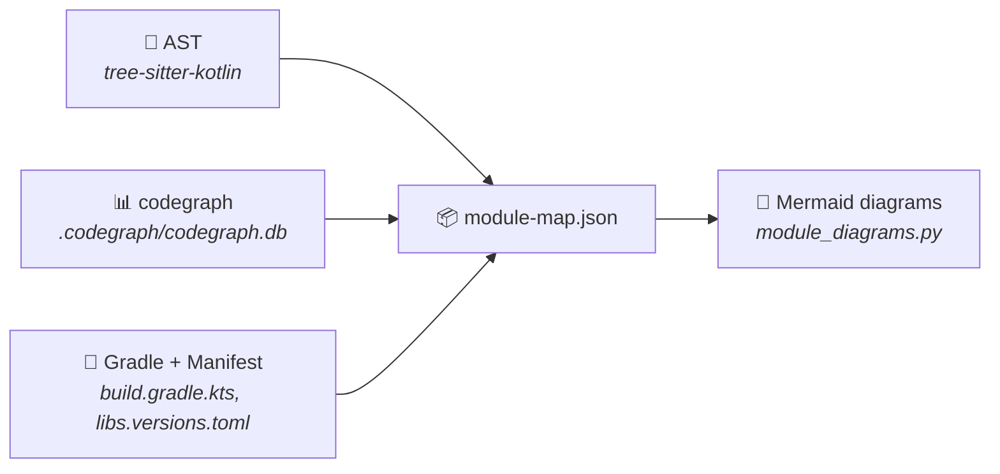

<div align="center">

# 🏗️ android-module-map

**Turn your Kotlin/Android modules into architecture diagrams — automatically.**

[](https://github.com/pfranccino/android-module-map/actions/workflows/ci.yml)
[](https://python.org)
[](LICENSE)

Two scripts. No Gradle build. No AI model. Same input → same output, every time.

[Quick Start](#-quick-start) · [Commands](#-commands) · [Features](#-features) · [Configuration](#%EF%B8%8F-configuration) · [How It Works](#-how-it-works) · [Examples](examples/)

</div>

---

Understanding how an Android module is wired — which layers talk to which, where
Hilt bindings land, what calls what — usually means reading every file or drawing
diagrams by hand. **This tool reads the code and draws them for you.**

```
module_map.py        source code  →  .module-map.json
module_diagrams.py   map JSON     →  .md  (Mermaid diagrams + analysis)
```

<details>
<summary><b>📊 See a generated diagram</b> (click to expand)</summary>

<br>

> Generated from the synthetic project in [`examples/`](examples/) with `--lang en`



</details>

---

## ✨ Features

| | Feature | Description |
|---|---|---|
| 🧱 | **Layered architecture** | Groups classes into Presentation, Domain, Data, and DI by package, annotation, and role — one color per layer |
| 🔀 | **Flow diagrams** | Traces ViewModel → use case → repository → API with AST-verified receivers |
| 📐 | **Sequence diagrams** | Step-by-step call sequence for any ViewModel function |
| 💉 | **Hilt/Dagger graph** | Maps `@Provides`, `@Binds`, `@Inject` across the module |
| 🚨 | **Violation detection** | Flags forbidden layer dependencies with `file:line` evidence |
| 🔗 | **Cross-module tracking** | Matches Gradle declarations against actual code usage |
| 📚 | **Version catalogs** | Resolves `libs.*` notations from `gradle/libs.versions.toml` to real coordinates |
| 🗺️ | **Scales to big modules** | Above 40 drawn nodes the layer diagram switches to one box per package |
| 🌐 | **English or Spanish** | English by default, `--lang es` for Spanish documents, messages and map legend |
| ⚙️ | **Configurable rules** | Layer names and forbidden dependencies live in `.module-map.toml`, not in the code |
| ♻️ | **Deterministic** | Same code → same output. Works in CI, code review, or as a Claude Code skill |

---

## 🚀 Quick Start

> **Requires Python 3.10+** · Works on Linux, macOS, and Windows

**Option A — install the commands** (recommended):

```bash
pipx install git+https://github.com/pfranccino/android-module-map

# from the root of your Android project
module-map feature/login
module-diagrams feature/login
```

**Option B — run the scripts from a clone**, with nothing installed:

```bash
python3 path/to/scripts/module_map.py feature/login
python3 path/to/scripts/module_diagrams.py feature/login
```

On Windows, use `python` instead of `python3`. In this mode `module_map.py` creates its own venv in
`~/.cache/module-map/venv` the first time it runs and installs `tree-sitter` there (needs network
once).

Output is in English by default. Add `--lang es` to both commands (or set `MODULE_MAP_LANG=es`, or
`lang = "es"` in [`.module-map.toml`](#%EF%B8%8F-configuration)) to get it in Spanish.

<details>
<summary><b>See expected output</b></summary>

```
[module_map +  0.0s] :feature:login: parsing 6 files...
[module_map +  0.1s] feature/login/docs/architecture/feature-login.module-map.json: 19 nodes, 5 externals, 29 edges, 0 warnings
```

```
generated: feature/login/docs/architecture/feature-login.md
```

```
feature/login/docs/architecture/
├── feature-login.module-map.json   ← structured map (nodes + edges)
├── feature-login.md                ← full document with all diagrams
└── feature-login.classes.md        ← only when --only is used
```

</details>

---

## 🧭 Commands

There are two commands, and you always run them in this order:

1. **`module-map`** reads the source code and writes a map (`.module-map.json`) per module.
2. **`module-diagrams`** reads those maps and writes the documents (`.md`, plus an index for several modules).

The table below gives the command for each task. Click a recipe under it to see what it does and the
output it prints. All examples run from the root of the Android project. Running from a clone instead
of installing? Replace `module-map` with `python3 path/to/scripts/module_map.py`, and
`module-diagrams` with `python3 path/to/scripts/module_diagrams.py`.

| I want to… | Run |
|---|---|
| Map one module | `module-map feature/login` |
| Map every module of the project | `module-map .` |
| Map one package of a big module | `module-map feature/login/src/main/kotlin/com/acme/login/ui` |
| Collect all the maps in one folder | `module-map . -o docs/maps` |
| Get maps that don't change unless the code does | `module-map . --no-timestamp` |
| Document one module | `module-diagrams feature/login` |
| Document every module, with a clickable index | `module-diagrams .` |
| Generate only some sections | `module-diagrams . --module login --only layers,violations` |
| Draw the sequence of a specific function | `module-diagrams feature/login --flow LoginViewModel.submit` |
| See which sections exist | `module-diagrams --sections` |
| Get the documents in Spanish | `module-diagrams feature/login --lang es` |

### `module-map`: read the code, write the map

<details>
<summary><b>Map one module</b> · <code>module-map feature/login</code></summary>

<br>

Reads every Kotlin file of the module, its `build.gradle.kts` and its `AndroidManifest.xml`, and
writes the map inside the module, in `docs/architecture/`. If the project has a codegraph index, the
map also gets the calls between classes.

```bash
module-map feature/login
```

```
[module_map +  0.1s] :feature:login: parsing 6 files...
[module_map +  0.1s] feature/login/docs/architecture/feature-login.module-map.json: 19 nodes, 5 externals, 29 edges, 0 warnings
```

</details>

<details>
<summary><b>Map every module of the project</b> · <code>module-map .</code></summary>

<br>

Give it a directory that holds several modules (the project root, or a folder such as `features/`)
and it finds every Gradle module below it. Each map goes inside its own module.

```bash
module-map .
```

```
[module_map +  0.0s] Gradle modules found in .: 3
[module_map +  0.0s] :app: parsing 1 files...
[module_map +  0.0s] app/docs/architecture/app.module-map.json: 1 nodes, 0 externals, 0 edges, 0 warnings
[module_map +  0.0s] :core:network: parsing 1 files...
[module_map +  0.1s] core/network/docs/architecture/core-network.module-map.json: 1 nodes, 2 externals, 2 edges, 0 warnings
[module_map +  0.1s] :feature:login: parsing 6 files...
[module_map +  0.1s] feature/login/docs/architecture/feature-login.module-map.json: 19 nodes, 5 externals, 29 edges, 0 warnings
[module_map +  0.1s] 3 maps written, each one inside its module
```

</details>

<details>
<summary><b>Map one package of a big module</b> · <code>module-map &lt;path to the package&gt;</code></summary>

<br>

When a module is too big to read as one diagram, point at one of its packages. Only the files in
that package are parsed, so the diagrams show just that part of the module.

```bash
module-map feature/login/src/main/kotlin/com/acme/login/ui -o docs/login-ui.json
```

```
[module_map +  0.0s] :feature:login: parsing 3 files...
[module_map +  0.0s] docs/login-ui.json: 9 nodes, 6 externals, 13 edges, 0 warnings
```

</details>

<details>
<summary><b>Collect all the maps in one folder</b> · <code>module-map . -o docs/maps</code></summary>

<br>

`-o` writes every map into one directory instead of inside each module. `module-diagrams` can read
that directory later.

```bash
module-map . -o docs/maps
```

```
[module_map +  0.1s] docs/maps/app.module-map.json: 1 nodes, 0 externals, 0 edges, 0 warnings
[module_map +  0.1s] docs/maps/core-network.module-map.json: 1 nodes, 2 externals, 2 edges, 0 warnings
[module_map +  0.1s] docs/maps/feature-login.module-map.json: 19 nodes, 5 externals, 29 edges, 0 warnings
[module_map +  0.1s] 3 maps written to docs/maps
```

</details>

<details>
<summary><b>Get maps that don't change unless the code does</b> · <code>--no-timestamp</code></summary>

<br>

By default each map records when it was made, so regenerating it always produces a diff. With
`--no-timestamp` that date is left out, and the same code gives byte-identical maps and documents.
Use it when the maps are committed, or in CI to check that they are up to date.

```bash
module-map . --no-timestamp
module-diagrams .
git diff --exit-code   # fails if someone changed the code without regenerating the docs
```

</details>

<details>
<summary><b>Choose the sources</b> · <code>--no-codegraph</code>, <code>--android-cli</code></summary>

<br>

- `--no-codegraph` ignores the codegraph index, even if the project has one. The map keeps the
  structure read from the code, but has no calls, so there are no flow or sequence diagrams.
- `--android-cli` also runs `android describe` and attaches the build metadata to the map. It
  runs Gradle, so it takes minutes instead of seconds, and the diagrams don't use it.

```bash
module-map feature/login --no-codegraph
module-map feature/login --android-cli
```

</details>

### `module-diagrams`: read the map, write the documents

<details>
<summary><b>Document one module</b> · <code>module-diagrams feature/login</code></summary>

<br>

Finds the map that `module-map` left in the module and writes the full document next to it:
every diagram and table listed in [What You Get](#-what-you-get). See
[`examples/feature-login.md`](examples/feature-login.md) for the result.

```bash
module-diagrams feature/login
```

```
generated: feature/login/docs/architecture/feature-login.md
```

</details>

<details>
<summary><b>Document every module, with a clickable index</b> · <code>module-diagrams .</code></summary>

<br>

Writes each module's document and, at the root, an overview of the group. The overview shows one box
per module and the Gradle dependencies between them, without the classes inside.

```bash
module-diagrams .
```

```
generated: app/docs/architecture/app.md
generated: core/network/docs/architecture/core-network.md
generated: feature/login/docs/architecture/feature-login.md
generated: docs/architecture/index.md
generated: docs/architecture/index.html
```

- `index.md` has the module graph and a table linking to each module's document. Clicking a module
  in the graph opens its document in viewers that allow Mermaid clicks (VS Code, Obsidian). GitHub
  doesn't, so on GitHub use the table links. See [`examples/index.md`](examples/index.md).
- `index.html` shows the same overview as a page. Clicking a module shows its diagrams on that
  page, with a link back to the overview. Open it in any browser. It loads marked and Mermaid from
  cdn.jsdelivr.net, so it needs a connection.

The index is written only when the run covers several modules without `--module` or `--only`, so a
partial run never replaces a full index.

</details>

<details>
<summary><b>Generate only some sections</b> · <code>--only</code>, <code>--module</code></summary>

<br>

`--only` takes a comma-separated list of [section keys](#-what-you-get). `--module` picks one module
out of a directory; the end of its Gradle path is enough. The partial document gets its own name, so
the full one is never overwritten.

```bash
module-diagrams . --module login --only layers,violations
```

```
generated: feature/login/docs/architecture/feature-login.layers-violations.md
```

</details>

<details>
<summary><b>Draw the sequence of a specific function</b> · <code>--flow Class.function</code></summary>

<br>

The sequence diagram follows one flow. Without `--flow`, the command picks the function with the
longest call chain, preferring ViewModels. A wrong name lists the flows that exist. This needs a map with calls, which come
from codegraph.

```bash
module-diagrams feature/login --flow LoginViewModel.nope
```

```
No calls recorded from LoginViewModel.nope. Available flows: AuthRepositoryImpl.login, AuthRepositoryImpl.logout, LoginModule.provideAuthApi, LoginUseCase.invoke, LoginActivity.onCreate, LoginScreen.LoginScreen, LoginViewModel.submit
```

```bash
module-diagrams feature/login --flow LoginViewModel.submit --only sequence
```



</details>

<details>
<summary><b>See which sections exist</b> · <code>module-diagrams --sections</code></summary>

<br>

```bash
module-diagrams --sections
```

```
layers             layered architecture diagram
flows              diagram of the flows from the ViewModels
sequence           sequence diagram of one flow
modules            module dependency diagram
hilt               dependency injection diagram
classes            table of every class with kind, layer, role and KDoc
violations         layer violations
entries            entry points
external           external dependencies
review             edges to review
```

</details>

<details>
<summary><b>Write the documents somewhere else</b> · <code>-o</code></summary>

<br>

`-o` takes a directory, or a `.md` file when there is only one module. It also works with maps
collected by `module-map -o`.

```bash
module-diagrams docs/maps -o docs/out
```

```
generated: docs/out/app.md
generated: docs/out/core-network.md
generated: docs/out/feature-login.md
generated: docs/out/index.md
generated: docs/out/index.html
```

</details>

<details>
<summary><b>Get the documents in Spanish</b> · <code>--lang es</code></summary>

<br>

Both commands are in English by default. `--lang es` switches the documents, the messages and the
legend inside the map to Spanish. To make it permanent, set `MODULE_MAP_LANG=es` or put
`lang = "es"` in [`.module-map.toml`](#%EF%B8%8F-configuration).

```bash
module-map feature/login --lang es
module-diagrams feature/login --lang es
```

```
generado: feature/login/docs/architecture/feature-login.md
```

</details>

The full list of options for each command is under [Options](#%EF%B8%8F-options).

---

## 📄 What You Get

Each document can include these sections — all generated by default, `--only` picks a subset:

| Key | Section | What it shows |
|:---:|---|---|
| `layers` | Architecture diagram | Classes grouped by layer with dependency arrows (packages for large modules) |
| `flows` | Flow diagram | ViewModel → use case → repository → API chains |
| `sequence` | Sequence diagram | Step-by-step call trace for one flow |
| `modules` | Module graph | Gradle dependencies + cross-module usage |
| `hilt` | DI diagram | Providers, bindings, and injection consumers |
| `classes` | Class table | Every type with kind, layer, role, and KDoc |
| `violations` | Layer violations | Forbidden dependencies with file:line evidence |
| `entries` | Entry points | Manifest components + usages from other modules |
| `external` | External deps | Dependencies by module and by library |
| `review` | Review edges | Corrections, low-confidence links, warnings |

> Subsets are written to `<module>.<sections>.md` — the full document is never overwritten.

---

## 📋 Requirements

| Dependency | Required | Notes |
|---|:---:|---|
| **Python 3.10+** | ✅ | `pipx` installs `tree-sitter`; in script mode `module_map.py` installs it in its own venv |
| **[codegraph](https://www.npmjs.com/package/@colbymchenry/codegraph)** | ❌ | Adds calls, instantiations, references. Run `codegraph init` once. Without it: no flow/sequence diagrams |
| **Android CLI** | ❌ | `--android-cli` attaches Gradle build metadata. Slow (runs Gradle) |

---

## ⚙️ Options

<details>
<summary><b>module-map</b> / <code>module_map.py</code> <code>&lt;dir&gt;</code></summary>

`<dir>` is a module, a package inside a module, or a directory containing several modules.

| Option | Meaning |
|---|---|
| `-o, --output` | Collect maps in this directory (or a `.json` file for one module) |
| `--no-codegraph` | Skip the codegraph index |
| `--android-cli` | Run `android describe` and attach build metadata |
| `--no-timestamp` | Leave `generated_at` out, so regenerating without code changes produces no diff |
| `--lang es\|en` | Language of the messages and of the legend inside the map |
| `--config` | Path to a `.module-map.toml` (looked up automatically otherwise) |

Maps are meant to be committed: they hold no absolute paths, and with `--no-timestamp` (or a fixed
`SOURCE_DATE_EPOCH`) the same code gives byte-identical maps and documents on any machine.

</details>

<details>
<summary><b>module-diagrams</b> / <code>module_diagrams.py</code> <code>&lt;path&gt;</code></summary>

`<path>` is a module, a directory of modules, a directory of maps, or one map JSON.

| Option | Meaning |
|---|---|
| `--only layers,flows` | Generate only these sections |
| `--module engine` | Process only this module from a multi-module directory |
| `--flow Class.function` | Pick the flow for the sequence diagram |
| `--sections` | List available section keys and exit |
| `-o, --output` | Output directory (or `.md` file for one module) |
| `--lang es\|en` | Language of the document and the messages |
| `--config` | Path to a `.module-map.toml` (looked up automatically otherwise) |

</details>

---

## 🛠️ Configuration

Put a `.module-map.toml` at the root of your Android project (next to `settings.gradle.kts`). Both
commands find it by walking up from the path you give them. Every key is optional. The quickest
start is to copy [`.module-map.example.toml`](.module-map.example.toml), which holds the defaults
with comments, and edit what you need. An example with overrides:

```toml
lang = "en"                  # es | en

[layers]
readable_limit = 60          # above this many nodes, the layer diagram is drawn by package
forbidden = [                # replaces the default rules entirely
    ["Presentation", "Data"],
    ["Domain", "Presentation"],
    ["Domain", "Data"],
]

[layers.by_segment]          # merged over the defaults: package segment -> layer
feature = "Presentation"
api = "Other"                # a default (api -> Data) can be overridden too

[layers.by_role]             # merged over the defaults: role -> layer
mapper = "Data"
```

Layers are `Presentation`, `Domain`, `Data`, `DI` and `Other`. An unknown key or layer stops the
run with a message instead of being ignored. Language precedence: `--lang`, then
`MODULE_MAP_LANG`, then `lang` in the file, then English.

---

## 🔍 How It Works

`module_map.py` combines three sources into a single JSON map:



| Source | What it provides |
|---|---|
| **AST** | Declarations, signatures, KDoc, annotations, inheritance, Hilt bindings, roles |
| **codegraph** | Calls, instantiations, references (including cross-module) |
| **Gradle + Manifest** | Module type, dependencies (with `libs.*` resolved through the version catalog), components — no Gradle execution needed |

<details>
<summary><b>Edge validation</b> — how false positives are filtered</summary>

<br>

codegraph resolves by name, so `isAuthorized()` can match an unrelated namesake. Each edge is
validated against the calling file:

1. **Receiver type** — `repo.load()` resolves via the declared type of `repo`
2. **Import match** — the import overrides codegraph's target when they differ
3. **Target import** — an import of the target class itself
4. **Same package** — target is in the caller's package or covered by a star import

No match → edge discarded. **Missing arrow > false arrow.**

</details>

<details>
<summary><b>JSON map structure</b></summary>

<br>

One node or edge per line, so `grep` works on it.

| Key | Content |
|---|---|
| `module` | Gradle path, type, namespace, plugins, dependencies (`resolved` coordinates for `libs.*`), Manifest |
| `nodes` | Declarations: FQN, kind, role, file, lines, KDoc, constructor, functions |
| `external_nodes` | Symbols outside the module (`project` or `library`) |
| `edges` | Typed relationships with `provenance`, `weight`, and `details` |
| `legend` | Meaning of each edge kind and provenance, in the chosen language |

</details>

<details>
<summary><b>Layer assignment</b></summary>

<br>

Layers are assigned by package segment (`ui` → Presentation, `domain` → Domain, `data` → Data,
`di` → DI), then by role, then by import heuristics, then by the layer of their neighbors.
Change the mapping in [`.module-map.toml`](#%EF%B8%8F-configuration).

</details>

---

## 🧪 Testing

```bash
python -m venv .venv
.venv/bin/pip install -e ".[test]"      # Windows: .venv\Scripts\pip
.venv/bin/pytest                          # Windows: .venv\Scripts\pytest
```

The suite covers the AST map, the codegraph edge validation (against a hand-built index), version
catalogs, configuration, both languages, the CLI end to end, and checks that the committed
[`examples/`](examples/) match what the script generates. CI runs it on Linux, macOS and Windows
with Python 3.10 and 3.13, plus a run of the scripts with nothing installed.

---

## 🤖 Claude Code Skill

Use this as a [Claude Code skill](https://docs.anthropic.com/en/docs/claude-code) by cloning
into your project's skills directory:

```bash
git clone https://github.com/pfranccino/android-module-map.git .claude/skills/module-map
```

The skill runs both scripts, then goes further: it verifies edges listed under "review" against
the source and describes classes missing KDoc.

---

## ⚠️ Limitations

> These are known boundaries — not bugs.

- **Syntactic only** — Kotlin-inferred types are invisible to the AST
- **Kotlin only** — Java classes appear via codegraph with minimal info
- **No test sources** — test code is excluded by design
- **Calls need codegraph** — without it, flow and sequence diagrams are empty
- **Gradle via regex** — dependencies added by convention plugins are not seen; only the default
  `gradle/libs.versions.toml` catalog is read. Declarations it cannot interpret (`fileTree(...)`,
  for instance) are listed under the map's warnings instead of being dropped
- **Not extracted** — navigation routes, UI state transitions, `Flow` collectors
- **Two languages** — English (default) and Spanish
- **`index.html` needs a connection** — it draws the diagrams with marked and Mermaid from a CDN;
  offline it shows the Markdown as plain text

---

## 🤝 Contributing

Contributions welcome! Please open an issue before submitting large changes. `main` is protected:
changes go through a pull request, and CI must pass.

```bash
git clone https://github.com/pfranccino/android-module-map.git
cd android-module-map
python -m venv .venv && .venv/bin/pip install -e ".[test]"
.venv/bin/pytest
```

After changing `module_diagrams.py`, regenerate the examples so their test keeps passing:

```bash
python scripts/module_diagrams.py examples
```

---

<div align="center">

**[MIT License](LICENSE)**

Made for Android developers who'd rather read diagrams than grep through modules.

</div>
