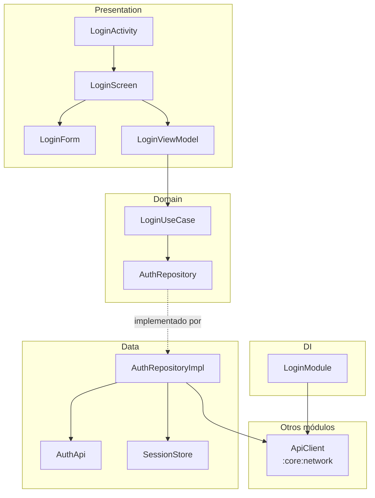

# android-module-map

Map a Kotlin/Android Gradle module to JSON and turn that map into architecture diagrams and an
analysis document. Two Python scripts, no model involved: the same code always produces the same
output, so it can run locally, in CI, or as a Claude Code skill.

```
module_map.py        source code  ->  <module>.module-map.json
module_diagrams.py   map JSON     ->  <module>.md  (Mermaid diagrams + analysis)
```

Example of a generated diagram (from the synthetic project in [`examples/`](examples)):



## Requirements

- **Python 3.10+.** Nothing to install by hand: on its first run `module_map.py` creates its own
  environment in `~/.cache/module-map/venv`, installs `tree-sitter==0.26.0` and
  `tree-sitter-kotlin==1.1.0` there, and re-runs itself inside it. That first run needs network
  access. `module_diagrams.py` only uses the standard library.
- **[codegraph](https://www.npmjs.com/package/@colbymchenry/codegraph)** (optional, tested with
  1.6.1). It provides calls, instantiations and references. Run `codegraph init` once at the root
  of the Android project. Without it the map still has the structure, but no calls, so the flow
  and sequence diagrams are empty.
- **Android CLI** (optional, off by default). `--android-cli` runs `android describe` and
  attaches its build metadata to the map. The diagrams do not use it, and it runs Gradle, which
  can take minutes.

## Quick start

Run both scripts from the root of the Android project. Each one takes just the directory.

One module:

```bash
python3 path/to/scripts/module_map.py feature/login
python3 path/to/scripts/module_diagrams.py feature/login
```

Every module inside a directory (or `.` for the whole project):

```bash
python3 path/to/scripts/module_map.py features
python3 path/to/scripts/module_diagrams.py features
```

One section for one module of that directory:

```bash
python3 path/to/scripts/module_diagrams.py features --module login --only classes
```

Everything is written inside each module, in `<module>/docs/architecture/`:

```
feature/login/docs/architecture/
├── feature-login.module-map.json   written by module_map.py
├── feature-login.md                full document
└── feature-login.classes.md        only when --only is used
```

With several modules, `module_diagrams.py` also writes `<directory>/docs/architecture/index.md`
with the graph of Gradle dependencies between them. To collect everything in a single directory
instead, pass `-o <directory>` to `module_map.py` and give that directory to `module_diagrams.py`.

## What you get

Each module document can contain these sections. All of them are generated by default;
`--only` selects a subset.

A subset is written to its own file, `<module>.<sections>.md` (for example `login.classes.md`),
so it never overwrites the full `<module>.md`. A module that has nothing to show for the
requested sections gets no file.

| Key | Section |
|---|---|
| `layers` | Layered architecture diagram (Presentation, Domain, Data, DI) |
| `flows` | Flows from the ViewModels: ViewModel → function → use case → repository → API |
| `sequence` | Sequence diagram of one flow |
| `modules` | Module dependencies: declared in Gradle, and modules that use this one |
| `hilt` | Hilt dependency injection: providers, bindings and consumers |
| `classes` | Table of every class, interface and object with kind, layer, role and KDoc |
| `violations` | Layer violations, with `file:line` evidence |
| `entries` | Entry points: Manifest components and usages from other modules |
| `external` | External dependencies, by module and by library |
| `review` | Edges to review: corrections, low-confidence edges, warnings, discarded count |

## Options

`module_map.py <dir>`: `<dir>` is a module, a package inside a module, or a directory that
contains several modules.

| Option | Meaning |
|---|---|
| `-o, --output` | Directory to collect the maps in, instead of inside each module. With a single module it can also be a `.json` file |
| `--no-codegraph` | Do not read the codegraph index |
| `--android-cli` | Run `android describe` and attach its build metadata |

`module_diagrams.py <path>`: `<path>` is a module, a directory that contains several modules, a
directory of maps, or one map JSON.

| Option | Meaning |
|---|---|
| `--only layers,flows` | Generate only these sections, in `<module>.<sections>.md` |
| `--module engine` | With several modules, process only that one |
| `--flow Class.function` | Flow for the sequence diagram (one module). Defaults to the ViewModel function with the longest call chain |
| `--sections` | List the available section keys and exit |
| `-o, --output` | Output directory instead of next to each map. With one module it can also be a `.md` file |

## How it works

`module_map.py` combines three sources:

1. **AST** (tree-sitter-kotlin): declarations, signatures, KDoc, annotations, inheritance,
   constructor dependencies, Hilt bindings and types used in signatures. Each class also gets a
   role (`viewmodel`, `composable`, `repository`, `usecase`, `dao`, `api_service`, ...) inferred
   from annotations, supertypes and name suffixes.
2. **codegraph**: calls, instantiations and references, including those that cross the module
   boundary. The script reads `.codegraph/codegraph.db` directly and lifts each method to the
   class that contains it, matching by file and line.
3. **Gradle and AndroidManifest**: module type, declared dependencies and components, read from
   the files without running Gradle.

### Only supported edges are kept

codegraph resolves symbols by name, so a call to `isAuthorized()` can be linked to an unrelated
namesake in another module. The file that makes the call settles the target, in this order:

1. the declared type of the receiver (`repo.load()`, or `useCase()` through `operator invoke`);
2. the import of the referenced name, which overrides codegraph's target when they differ;
3. an import of the target class itself;
4. the target being in the same package or covered by a star import.

An edge with none of these is discarded and counted in `sources.codegraph.edges_discarded`.
Corrected edges keep what codegraph proposed in `corrected_from`. The result favors a missing
arrow over a false one.

### The map

One node or edge per line, so `grep` works on it.

| Key | Content |
|---|---|
| `module` | Gradle path, type, namespace, plugins, declared dependencies, Manifest |
| `nodes` | Declarations: id (FQN), kind, role, file, lines, KDoc, constructor, properties, functions |
| `external_nodes` | Symbols outside the module. `origin: project` is another module of the repo; `library` is a dependency |
| `edges` | `extends`, `implements`, `depends_on`, `provides`, `uses_type`, `calls`, `instantiates`, `references`, each with `provenance`, `weight` and `details` |
| `sources`, `warnings` | Which sources were used, and files that parsed only partially |
| `legend` | Meaning of each edge kind and provenance, so a consumer does not have to guess |

### Layers and violations

`module_diagrams.py` assigns a layer by package segment (`ui`, `presentation`, `domain`, `data`,
`di`) and, failing that, by role. Anything else goes to `Other`, which is drawn but not checked
for violations. The rules are constants at the top of the script (`LAYER_BY_SEGMENT`,
`LAYER_BY_ROLE`, `FORBIDDEN`); edit them if your packages use other names.

## Claude Code skill

This repository is laid out as a skill: `SKILL.md` at the root with the scripts next to it. To
use it, clone it into the skills directory of your project:

```bash
git clone <this-repo-url> .claude/skills/module-map
```

The skill runs both scripts and then does the two things a script cannot: it checks the edges
listed under "review" against the source, and describes the classes that have no KDoc.

## Limitations

- The AST pass is syntactic. Types that Kotlin infers are unknown, so a property without a
  declared type has no type in the map.
- Only Kotlin files are parsed. Java classes appear through codegraph with minimal information.
- Test source sets are excluded.
- Calls depend on codegraph. Calls to classes that the calling file neither imports nor declares
  are discarded, so some real calls are missing.
- A module whose function is called from another module can miss that caller when codegraph
  linked the call to a namesake.
- Gradle files are read with regular expressions: dependencies added by convention plugins are
  not seen, and type-safe project accessors with camelCase names may not match the module path.
- Navigation routes, UI state transitions and `Flow` collectors are not extracted.
- The grammar reports a partial parse for some single-line class bodies; those files are listed
  under `warnings`.
- The optional `android describe` step was written from the Android CLI documentation and has
  not been verified against the real binary.
- CLI messages, the legend inside the JSON and the generated documents are in Spanish.
