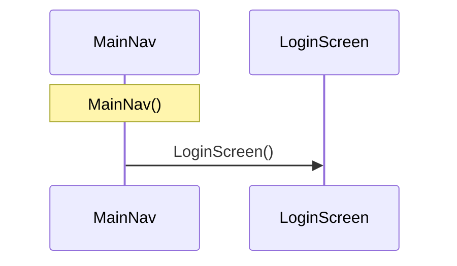

# :app: arquitectura

Generado por `module_diagrams.py` a partir del mapa del 2026-10-02T23:39:02+00:00. 1 nodos y 1 aristas. No editar a mano: se regenera desde el mapa.

## Arquitectura por capas

Flecha sólida: depende de o llama a. Flecha punteada: relación de tipos.

## Flujos desde los ViewModels

El mapa no registra llamadas fiables desde un ViewModel de este módulo.

## Secuencia: MainNav.MainNav

Solo llamadas entre clases, en orden de línea. No refleja ramas, bucles ni asincronía; otro flujo con `--flow Clase.funcion`.

## Dependencias entre módulos

Salientes: declaradas en Gradle. Entrantes (`usa`): usos observados en el código.

## Inyección de dependencias

El mapa no registra `@Provides`, `@Binds` ni dependencias con `@Inject`.

## Clases

| Clase | Tipo | Capa | Rol | Responsabilidad (KDoc) |
|---|---|---|---|---|
| MainNav | function | Presentation | composable | (sin KDoc) |

## Violaciones de capas

No se encontraron violaciones. Se revisaron todas las aristas entre clases del módulo contra estas dependencias prohibidas: Data → Presentation, Domain → Data, Domain → Presentation, Presentation → Data.

## Puntos de entrada

El mapa no registra componentes en el Manifest ni usos desde otros módulos.

## Dependencias externas

| Origen | Tipo externo | Usado por |
|---|---|---|
| :feature:login | com.acme.login.ui.LoginScreen | MainNav |

## Aristas a revisar

Nada que revisar.
