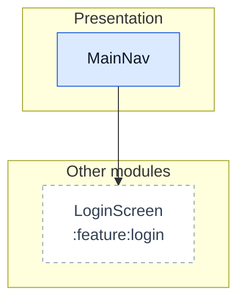
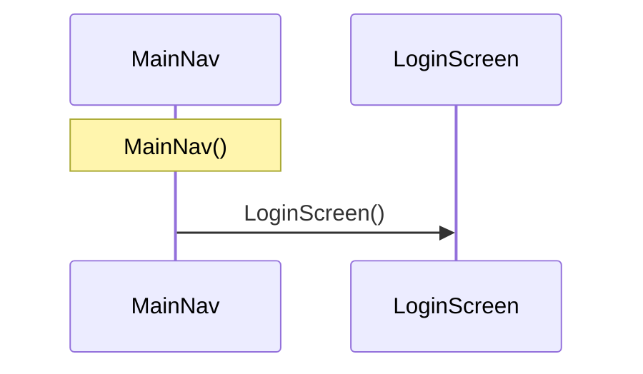

# :app: architecture

Generated by `module_diagrams.py` from the map of 2026-10-02T23:39:02+00:00. 1 nodes and 1 edges. Do not edit by hand: it is regenerated from the map.

## Layered architecture

Solid arrow: depends on or calls. Dotted arrow: type relationship.

## Flows from the ViewModels

The map has no reliable calls from a ViewModel of this module.

## Sequence: MainNav.MainNav

Only calls between classes, in line order. Branches, loops and asynchrony are not shown; pick another flow with `--flow Class.function`.

## Module dependencies

Outgoing: declared in Gradle. Incoming (`uses`): usages observed in the code.

## Dependency injection

The map has no `@Provides`, `@Binds` or `@Inject` dependencies.

## Classes

| Class | Kind | Layer | Role | Responsibility (KDoc) |
|---|---|---|---|---|
| MainNav | function | Presentation | composable | (no KDoc) |

## Layer violations

No violations found. Every edge between classes of the module was checked against these forbidden dependencies: Data → Presentation, Domain → Data, Domain → Presentation, Presentation → Data.

## Entry points

The map has no Manifest components and no usages from other modules.

## External dependencies

| Origin | External type | Used by |
|---|---|---|
| :feature:login | com.acme.login.ui.LoginScreen | MainNav |

## Edges to review

Nothing to review.
