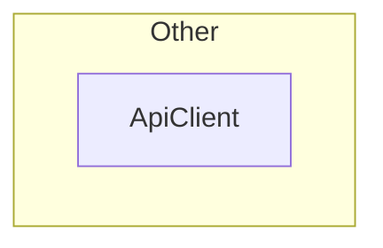
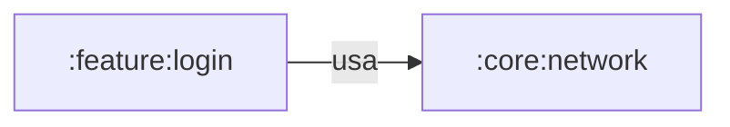

# :core:network: arquitectura

Generado por `module_diagrams.py` a partir del mapa del 2026-10-02T23:39:02+00:00. 1 nodos y 2 aristas. No editar a mano: se regenera desde el mapa.

## Arquitectura por capas

Flecha sólida: depende de o llama a. Flecha punteada: relación de tipos.

## Flujos desde los ViewModels

El mapa no registra llamadas fiables desde un ViewModel de este módulo.

## Secuencia

El mapa no tiene llamadas (`calls`) que salgan de este módulo, así que no hay flujo que dibujar. Las llamadas vienen de codegraph: revisa en «Aristas a revisar» si se usó.

## Dependencias entre módulos

Salientes: declaradas en Gradle. Entrantes (`usa`): usos observados en el código.

## Inyección de dependencias

El mapa no registra `@Provides`, `@Binds` ni dependencias con `@Inject`.

## Clases

| Clase | Tipo | Capa | Rol | Responsabilidad (KDoc) |
|---|---|---|---|---|
| ApiClient | class | Other | - | (sin KDoc) |

## Violaciones de capas

No se encontraron violaciones. Se revisaron todas las aristas entre capas con estas reglas: Presentation no depende de Data, Domain no depende de Presentation ni de Data, Data no depende de Presentation. La capa DI está exenta.

## Puntos de entrada

**Usado desde otros módulos**

| Elemento de este módulo | Lo usa | Módulo | Tipo |
|---|---|---|---|
| ApiClient | AuthRepositoryImpl | :feature:login | calls |
| ApiClient | LoginModule | :feature:login | calls |

## Dependencias externas

El mapa no registra dependencias externas.

## Aristas a revisar

Nada que revisar.
