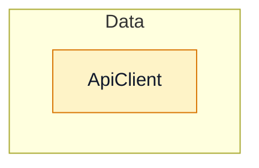
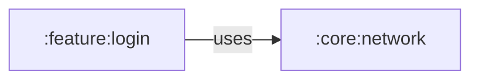

# :core:network: architecture

Generated by `module_diagrams.py` from the map of 2026-10-02T23:39:02+00:00. 1 nodes and 2 edges. Do not edit by hand: it is regenerated from the map.

## Layered architecture

Solid arrow: depends on or calls. Dotted arrow: type relationship.

## Flows from the ViewModels

The map has no reliable calls from a ViewModel of this module.

## Sequence

The map has no calls (`calls`) leaving this module, so there is no flow to draw. Calls come from codegraph: check under "Edges to review" whether it was used.

## Module dependencies

Outgoing: declared in Gradle. Incoming (`uses`): usages observed in the code.

## Dependency injection

The map has no `@Provides`, `@Binds` or `@Inject` dependencies.

## Classes

| Class | Kind | Layer | Role | Responsibility (KDoc) |
|---|---|---|---|---|
| ApiClient | class | Data | - | (no KDoc) |

## Layer violations

No violations found. Every edge between classes of the module was checked against these forbidden dependencies: Data → Presentation, Domain → Data, Domain → Presentation, Presentation → Data.

## Entry points

**Used from other modules**

| Element of this module | Used by | Module | Kind |
|---|---|---|---|
| ApiClient | AuthRepositoryImpl | :feature:login | calls |
| ApiClient | LoginModule | :feature:login | calls |

## External dependencies

The map has no external dependencies.

## Edges to review

Nothing to review.
