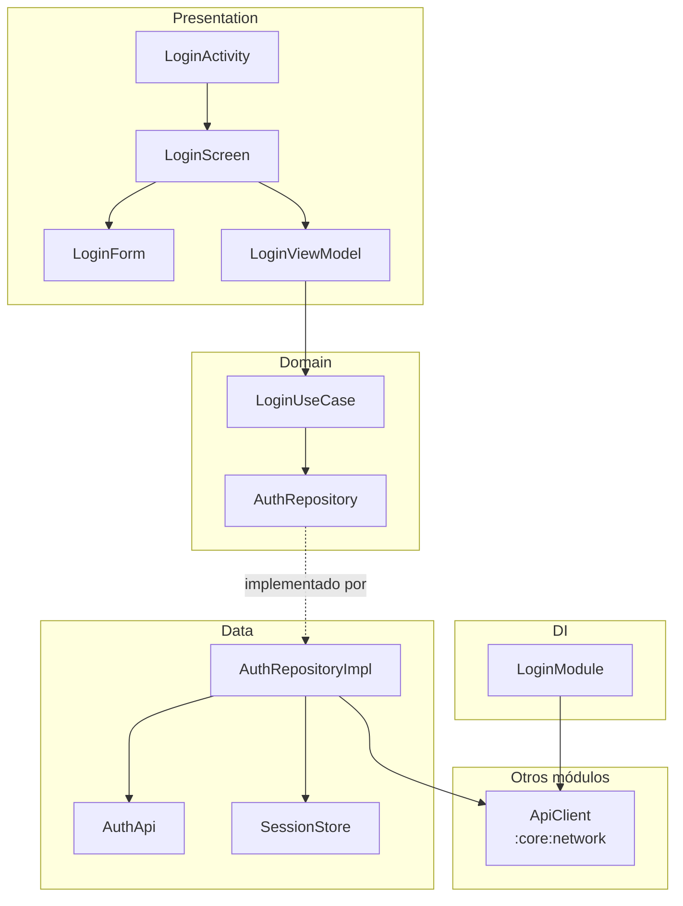
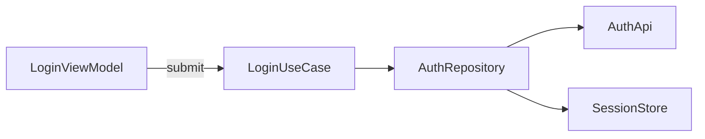
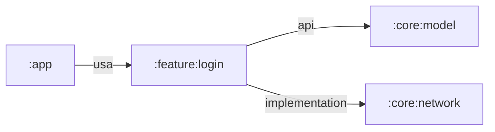
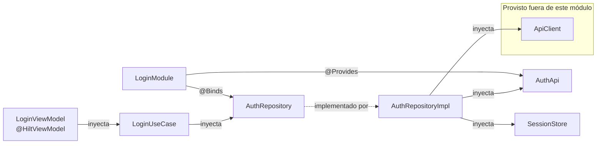

# :feature:login: arquitectura

Generado por `module_diagrams.py` a partir del mapa del 2026-10-02T23:39:02+00:00. 19 nodos y 42 aristas. No editar a mano: se regenera desde el mapa.

## Arquitectura por capas

Flecha sólida: depende de o llama a. Flecha punteada: relación de tipos.

## Flujos desde los ViewModels

La etiqueta de cada flecha que sale de un ViewModel es la función que inicia la llamada. Cada implementación se dibuja como su interfaz. Solo llamadas dentro del módulo que el AST confirmó por el tipo del receptor o que codegraph resolvió con confianza de 0.9 o más.

## Secuencia: LoginViewModel.submit

Solo llamadas entre clases, en orden de línea. No refleja ramas, bucles ni asincronía; otro flujo con `--flow Clase.funcion`.

## Dependencias entre módulos

Salientes: declaradas en Gradle. Entrantes (`usa`): usos observados en el código.

## Inyección de dependencias

## Clases

| Clase | Tipo | Capa | Rol | Responsabilidad (KDoc) |
|---|---|---|---|---|
| LoginActivity | class | Presentation | activity | (sin KDoc) |
| LoginScreen | function | Presentation | composable | (sin KDoc) |
| LoginForm | function | Presentation | composable | (sin KDoc) |
| LoginViewModel | class | Presentation | viewmodel | Coordina el flujo de inicio de sesión y expone el estado a la UI. |
| LoginUiState | sealed interface | Presentation | - | (sin KDoc) |
| LoginUiState.Idle | data object | Presentation | - | (sin KDoc) |
| LoginUiState.Loading | data object | Presentation | - | (sin KDoc) |
| LoginUiState.Success | data class | Presentation | - | (sin KDoc) |
| LoginUiState.Error | data class | Presentation | - | (sin KDoc) |
| Session | data class | Domain | - | (sin KDoc) |
| AuthRepository | interface | Domain | repository | (sin KDoc) |
| LoginUseCase | class | Domain | usecase | (sin KDoc) |
| AuthApi | interface | Data | api_service | (sin KDoc) |
| LoginRequest | data class | Data | - | (sin KDoc) |
| LoginResponse | data class | Data | - | (sin KDoc) |
| AuthRepositoryImpl | class | Data | repository | (sin KDoc) |
| SessionStore | class | Data | - | (sin KDoc) |
| LoginModule | abstract class | DI | di_module | (sin KDoc) |

## Violaciones de capas

No se encontraron violaciones. Se revisaron todas las aristas entre capas con estas reglas: Presentation no depende de Data, Domain no depende de Presentation ni de Data, Data no depende de Presentation. La capa DI está exenta.

## Puntos de entrada

**Componentes del Manifest**

| Tipo | Clase | Exported |
|---|---|---|
| activity | com.acme.login.ui.LoginActivity | sí |

**Usado desde otros módulos**

| Elemento de este módulo | Lo usa | Módulo | Tipo |
|---|---|---|---|
| LoginScreen | MainNav | :app | calls |

## Dependencias externas

| Origen | Tipo externo | Usado por |
|---|---|---|
| :core:network | com.acme.network.ApiClient | AuthRepositoryImpl, LoginModule |
| librería | android.os.Bundle | LoginActivity |
| librería | androidx.activity.ComponentActivity | LoginActivity |
| librería | androidx.lifecycle.ViewModel | LoginViewModel |
| librería | kotlinx.coroutines.flow.StateFlow | LoginViewModel |

Declarados en Gradle sin uso observado en el código Kotlin (el mapa no ve recursos ni código generado, así que no implica que sobren): :core:model.

## Aristas a revisar

- Confianza 0.7: `AuthRepositoryImpl → toSession` (calls: login → toSession, feature/login/src/main/kotlin/com/acme/login/data/AuthRepositoryImpl.kt:26). Resuelta por nombre; revisar en el código.
- Corregida: `LoginViewModel → LoginUseCase` (submit → invoke, feature/login/src/main/kotlin/com/acme/login/ui/LoginViewModel.kt:28). codegraph proponía `AuthApi`; se usó el tipo declarado del receptor.
