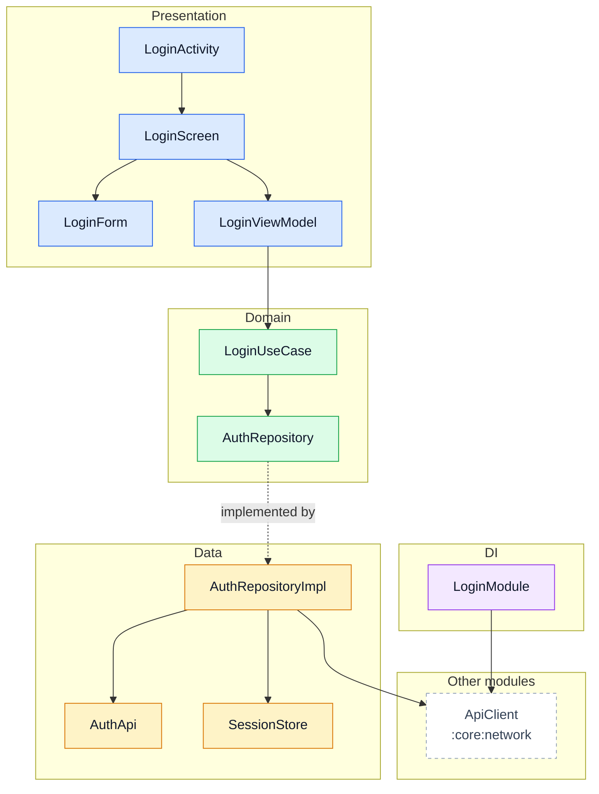
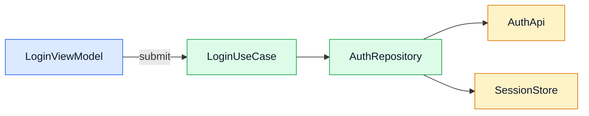
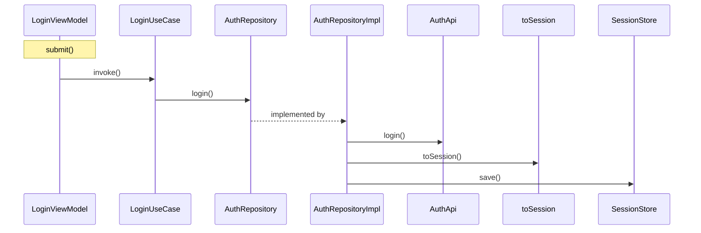
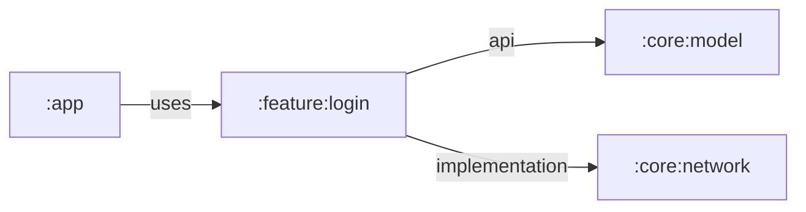
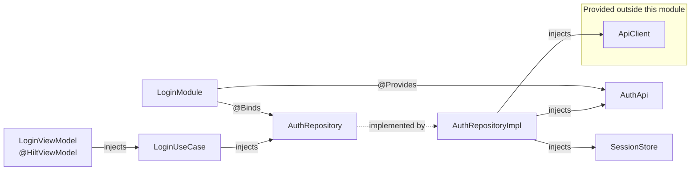

# :feature:login: architecture

Generated by `module_diagrams.py` from the map of 2026-10-02T23:39:02+00:00. 19 nodes and 42 edges. Do not edit by hand: it is regenerated from the map.

## Layered architecture

Solid arrow: depends on or calls. Dotted arrow: type relationship.

## Flows from the ViewModels

The label of each arrow leaving a ViewModel is the function that starts the call. Each implementation is drawn as its interface. Only calls inside the module that the AST confirmed through the receiver type, or that codegraph resolved with confidence 0.9 or more.

## Sequence: LoginViewModel.submit

Only calls between classes, in line order. Branches, loops and asynchrony are not shown; pick another flow with `--flow Class.function`.

## Module dependencies

Outgoing: declared in Gradle. Incoming (`uses`): usages observed in the code.

## Dependency injection

## Classes

| Class | Kind | Layer | Role | Responsibility (KDoc) |
|---|---|---|---|---|
| LoginActivity | class | Presentation | activity | (no KDoc) |
| LoginScreen | function | Presentation | composable | (no KDoc) |
| LoginForm | function | Presentation | composable | (no KDoc) |
| LoginViewModel | class | Presentation | viewmodel | Coordina el flujo de inicio de sesión y expone el estado a la UI. |
| LoginUiState | sealed interface | Presentation | - | (no KDoc) |
| LoginUiState.Idle | data object | Presentation | - | (no KDoc) |
| LoginUiState.Loading | data object | Presentation | - | (no KDoc) |
| LoginUiState.Success | data class | Presentation | - | (no KDoc) |
| LoginUiState.Error | data class | Presentation | - | (no KDoc) |
| Session | data class | Domain | - | (no KDoc) |
| AuthRepository | interface | Domain | repository | (no KDoc) |
| LoginUseCase | class | Domain | usecase | (no KDoc) |
| AuthApi | interface | Data | api_service | (no KDoc) |
| LoginRequest | data class | Data | - | (no KDoc) |
| LoginResponse | data class | Data | - | (no KDoc) |
| AuthRepositoryImpl | class | Data | repository | (no KDoc) |
| SessionStore | class | Data | - | (no KDoc) |
| LoginModule | abstract class | DI | di_module | (no KDoc) |

## Layer violations

No violations found. Every edge between classes of the module was checked against these forbidden dependencies: Data → Presentation, Domain → Data, Domain → Presentation, Presentation → Data.

## Entry points

**Manifest components**

| Type | Class | Exported |
|---|---|---|
| activity | com.acme.login.ui.LoginActivity | yes |

**Used from other modules**

| Element of this module | Used by | Module | Kind |
|---|---|---|---|
| LoginScreen | MainNav | :app | calls |

## External dependencies

| Origin | External type | Used by |
|---|---|---|
| :core:network | com.acme.network.ApiClient | AuthRepositoryImpl, LoginModule |
| library | android.os.Bundle | LoginActivity |
| library | androidx.activity.ComponentActivity | LoginActivity |
| library | androidx.lifecycle.ViewModel | LoginViewModel |
| library | kotlinx.coroutines.flow.StateFlow | LoginViewModel |

Declared in Gradle with no usage seen in the Kotlin code (the map does not see resources or generated code, so this does not mean they are unneeded): :core:model.

## Edges to review

- Confidence 0.7: `AuthRepositoryImpl → toSession` (calls: login → toSession, feature/login/src/main/kotlin/com/acme/login/data/AuthRepositoryImpl.kt:26). Resolved by name; check it in the code.
- Corrected: `LoginViewModel → LoginUseCase` (submit → invoke, feature/login/src/main/kotlin/com/acme/login/ui/LoginViewModel.kt:28). codegraph proposed `AuthApi`; the declared type of the receiver was used instead.
